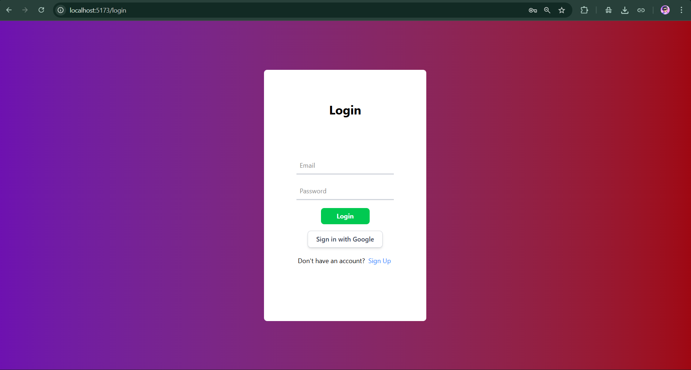
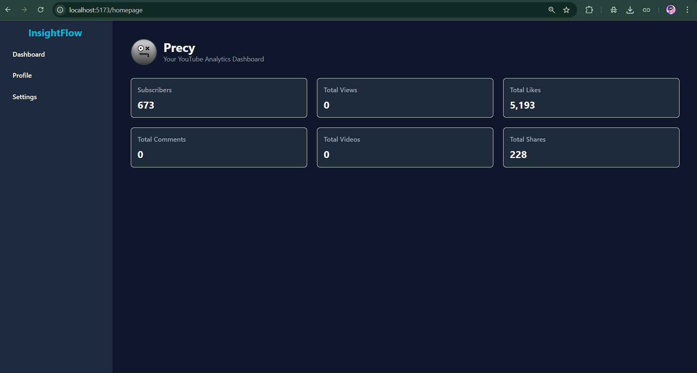
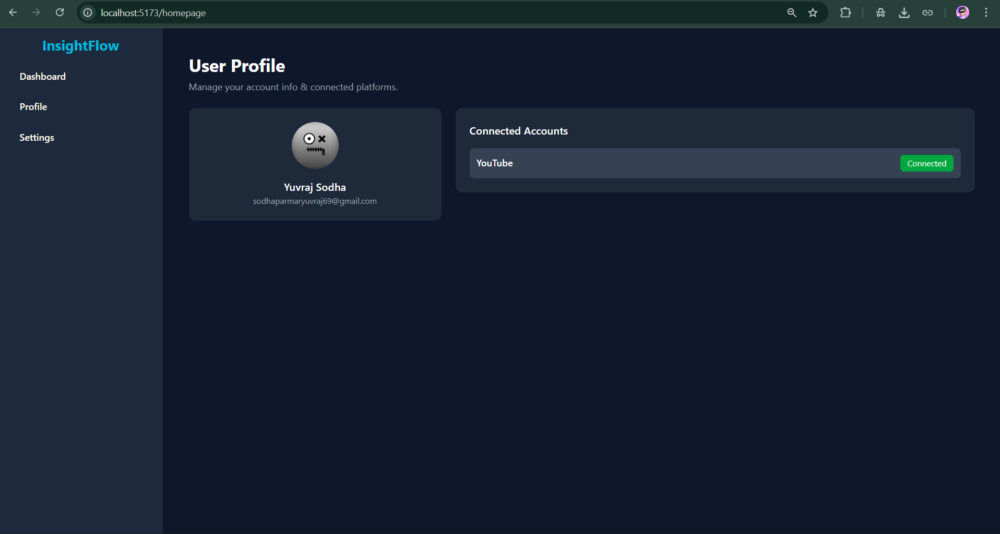

# Social Media Analytics Tool

A full-stack social media analytics application built using **MERN Stack (MongoDB, Express, React, Node.js)**.  
Supports **Google login**, JWT authentication, and interactive data visualization dashboards across multiple social media platforms.

---

## Features

- Track and visualize analytics from multiple social media platforms (YouTube, Instagram, etc.)  
- User authentication using **Google OAuth 2.0**  
- Secure sessions with **JWT tokens**  
- RESTful API for backend operations  
- Responsive and interactive dashboards using React  

---

## Tech Stack

- **Frontend:** React, Tailwind CSS  
- **Backend:** Node.js, Express  
- **Database:** MongoDB  
- **Authentication:** Google OAuth 2.0, JWT  

---

## Screenshots

### Login Page


### Dashboard


### User Profile


### Analytics Charts


---

## Installation

1. **Clone the repository:**  
```bash
git clone https://github.com/yuvrajsodha0009/Social-Media-Analytics-Tool.git
cd Social-Media-Analytics-Tool
